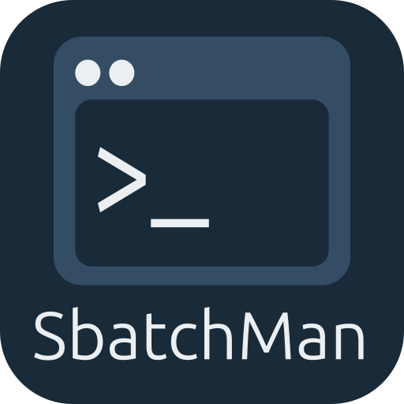

# Welcome to SbatchMan!

  

SbatchMan simplifies the process of running and managing code experiments locally and on multiple remote clusters. It streamlines your workflow, allowing you to focus on your research rather than the complexities of job submission and cluster management.

To get started, check out the [installation guide](install/install.md) to set up SbatchMan on your system.  
Then, follow the [tutorial](learn/tutorial.md) to learn how to use SbatchMan effectively.

## Features
- **Flexible configurations**: Use YAML files to define multiple configurations for different clusters.
- **Job management**: Launch, monitor, and archive jobs with simple commands.
- **Powerful job launching**: Launch jobs with custom commands and configurations defined in a YAML file, automatically generating all combinations of variables.
- **Command-line interface**: Interact with SbatchMan through a user-friendly CLI.
- **Python API**: Integrate SbatchMan into your Python scripts to parse job results effortlessly.
- **Archive utility**: Keep track of your past experiments and their results.
- **User friendly**: All configurations and logs are stored locally within your project directory, making it easy to manually inspect the commands and results.

### User Interface

*The SbatchMan TUI provides an interactive way to view the status of your jobs directly from the terminal.*

